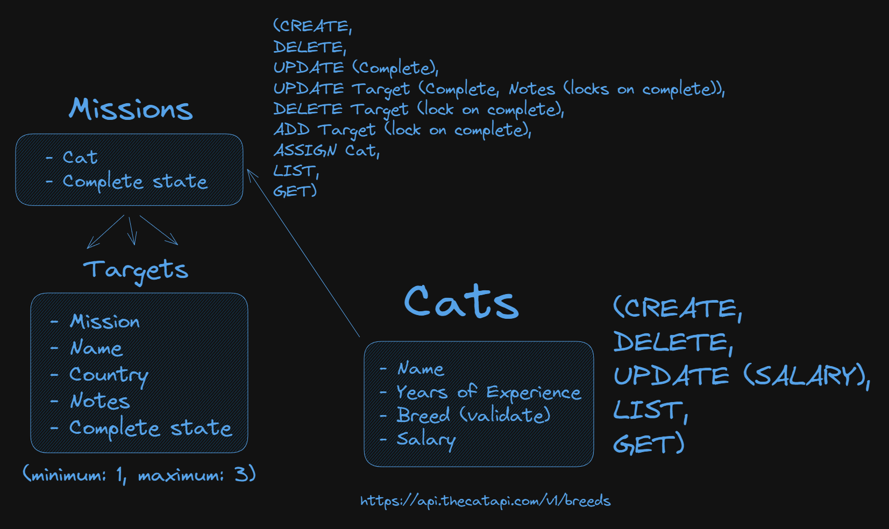

# Spy Cat Agency management application (DevelopsToday test assessment)

## Description

Layered CRUD RESTful API for managing spy cats, missions, and targets. Built with Go using Fiber, an PostgreSQL database and logging middleware. Includes integration with TheCatAPI for breed validation, Postman documentation, and Dockerized setup for quick deployment.

## Logic structure



## Features

- Layered architecture
- Fully dockerized project
- API postman documentation
- Interaction with a third-party api

## Technologies

- Go
- PostgreSQL
- Docker
- Postman
- Fiber
- Sonic

## Requirements

- Go 1.23+
- Docker
- GNU utils (make)
- Postman

## Local development

Make sure you're on Go version 1.23+.

Rename `.example.env` to `.env` and change environment variables you want.

### Run the project:

You can run both app and db in Docker:

```bash
docker-compose up -d
```

Or run db in Docker and app locally:

```bash
docker-compose up -d db
```

```bash
make run
```

## API testing with Postman

1. Open Postman.
2. Click "Import" and select `postman/sca-manager.postman_collection.json`.
3. Set environment variables if needed.
4. Run requests or use the collection in a Postman test runner.
